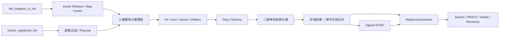

# 🗺️ ROGMap · Projection · ESDF

> 为高速局部规划定制的滚动占据地图：接收 Point-LIO 稠密点云，维护概率占据、语义投影层与有符号 ESDF，并向 MincoPlanner 提供低延迟进程内查询。

[返回项目主页](../../../README.md) · [Point-LIO](../Point-LIO/README.md) · [MINCO Planner](../../navigation/minco_planner/README.md)

## ✨ 模块定位

本仓库中的 ROGMap 不是独立地图节点：`MincoPlanner` 插件在配置阶段创建地图实例，并获取 `MapQueryInterface` 指针。地图仍通过 ROS 2 接收点云与里程计、发布可视化，但规划搜索、轨迹优化与安全检查可以直接查询内存中的地图状态。

主要能力：

- 以机器人为中心的三维滑动概率占据栅格。
- 基于 raycast 的 hit / miss 更新与可选时间衰减。
- 将三维观测投影为二维可通行性/地形层。
- dirty-column 增量维护，避免每周期全图重复投影。
- 有符号 ESDF，为 MINCO 障碍代价与安全检查提供距离和梯度。
- SensorData QoS `keep_last(1)` 接收最新稠密点云。
- 地图更新、投影、ESDF 与可视化频率可独立控制。

## 🧠 模块流程图



### 流程概述

世界系稠密点云和 latest-state odom 分别进入独立回调组。更新 timer 使用最近一批有效观测执行 raycast、概率更新、衰减和膨胀，并标记受影响的 XY 柱；ProjectionLayer 对 dirty columns 或全图做二维分类，随后与 PGM/YAML 先验作保守合并并刷新 Signed ESDF。Planner 通过进程内 `MapQueryInterface` 查询结果，可视化只在存在订阅者时按独立频率构造。

## 🧪 技术方向

- 三维层以 hit/miss 概率更新表达 occupied/free/unknown，并通过滑动窗口限制局部有效范围。
- ProjectionLayer 在固定 XY 柱内统计已观测体素、占据高度跨度和垂直占据率，输出 `FREE / PASSABLE / OCCUPIED / UNKNOWN`。
- 先验融合只把先验 occupied 写入动态投影，先验 free 不会清除在线障碍。
- Signed ESDF 为搜索、MINCO 软代价、发布前安全检查和恢复方向提供距离/梯度。
- decay 通过 `keep_time → clear_time` 处理动态障碍残影，但仍依赖可靠的 miss ray 和持续观测。

## ⚡ 性能方向

- 点云订阅使用 `SensorDataQoS().keep_last(1)`、`UniquePtr` callback 和显式 intra-process，避免大点云排队并减少同进程复制。
- odom 订阅使用 `KeepLast(1) + best_effort + volatile`，只维护地图中心所需的最新状态。
- dirty-column 增量投影只刷新变化列；dirty 比例超过阈值时回退全量刷新，避免增量维护反而更慢。
- raycast 可配置并行线程；当前比赛 YAML 中 `parallel_raycast_enable: false`，不能把并行 raycast 描述为默认启用。
- 地图查询走内存接口；可视化 publisher 统一使用 `KeepLast(1) + best_effort + volatile`，且按订阅者需求构造消息。
- `PerformanceMonitor` 支持 detailed/summary CSV 和终端摘要，覆盖输入、地图、投影、ESDF 与 snapshot 复制链路。

## 🧱 地图层语义

| 层 | 作用 |
|---|---|
| Occupancy | 三维 free / occupied / unknown 概率状态 |
| Inflated Occupancy | 按机器人安全尺度膨胀后的障碍状态 |
| Projection Layer | 柱状投影得到的 free、passable、occupied、unknown 等二维语义 |
| ESDF | 到最近障碍的有符号距离及梯度 |
| Active Window | 随机器人移动的局部有效地图范围 |

投影层不是简单“取最高点”。它综合指定 Z 范围内的观测数量、表面高度变化、墙面/隧道判据、未知状态和迟滞保持，减少孔洞及稀疏回波导致的瞬时跳变。但当前实现是**单柱高度统计分类，不是坡面分割或地面模型拟合**。

## 📡 ROS 接口

### 输入

| Topic | 类型 | 说明 |
|---|---|---|
| `/cloud_registered_full` | `sensor_msgs/msg/PointCloud2` | `camera_init` 世界系稠密点云 |
| `/aft_mapped_to_init` | `nav_msgs/msg/Odometry` | 地图中心、传感器状态与超时判断 |

### 可视化输出

| Topic | 内容 |
|---|---|
| `/rog_map/occupied` | 占据点 |
| `/rog_map/raw_occupied` | 未膨胀占据点 |
| `/rog_map/unknown` | 未知体素 |
| `/rog_map/inflated_occupied` | 膨胀障碍 |
| `/rog_map/frontier` | 前沿区域 |
| `/rog_map/esdf` | ESDF 可视化 |
| `/rog_map/layer_value` | 动态与 PGM 静态先验融合后的二维障碍投影 |
| `/rog_map/layer_value_dynamic` | 仅在线三维感知生成的动态二维障碍投影 |
| `/rog_map/layer_value_static` | 仅 PGM 静态先验在当前 ROGMap 网格上的二维障碍投影 |
| `/rog_map/layer_type` | 四类投影结果；RViz Map 使用 `costmap` 配色显示 UNKNOWN/FREE/PASSABLE/OCCUPIED |
| `/rog_map/layer_confidence` | 分类置信度 |
| `/rog_map/layer_height_delta` | 柱内高度变化 |
| `/rog_map/field` | 势场/距离场诊断 |
| `/rog_map/decay_cells` | 衰减单元诊断 |
| `/rog_map/map_bound` | 当前滑动地图边界 |
| `/cloud_registered_crop_filter/markers` | 入图前区域过滤框与 Z 截断平面；仅在过滤和可视化均启用时发布 |

## ⚙️ 关键配置

参数位于 `src/navigation/navi2_bringup/params/sentry1.yaml`：

```text
planner_server.ros__parameters.MincoPlanner.rog_map
```

### 地图几何

| 参数 | 当前典型值 | 说明 |
|---|---:|---|
| `resolution` | `0.05` m | 体素分辨率 |
| `inflation_resolution` | `0.05` m | 膨胀层分辨率 |
| `map_size` | `[10, 10, 1.5]` m | 滑动地图物理尺寸 |
| `map_sliding.threshold` | `0.2` | 触发中心滑动的位移阈值 |
| `map_sliding.center_offset_enable` | `true` | 启用地图中心偏置 |
| `map_sliding.center_offset` | `[0, 0.20, 0]` | 地图窗口相对 odom 参考点的中心偏移 |

`center_offset` 用于移动局部地图窗口，不是雷达外参，也不改变点云坐标。它通常与车体几何中心相关，但必须根据实际参考点定义标定。

### 入图前点云区域过滤

`cloud_filter.enable` 默认关闭。启用后，ROGMap 在 raycast 和概率占据更新之前删除指定区域内的点，过滤结果会同时影响三维占据、Projection、Field 和 ESDF。参数语义与 `msg_convert/cloud_registered_crop_filter` 保持一致：

| 参数 | 说明 |
|---|---|
| `position_frame` | 过滤框坐标系，当前配置为 `map` |
| `filter_mode` | `transform_cloud` 转换检测点；`transform_center` 转换过滤框中心 |
| `remove_inside` | `true` 删除框内点；`false` 仅保留框内点 |
| `position.*`, `box_size.*` | 单框回退参数 |
| `positions.*`, `box_sizes.*` | 多框中心与尺寸数组，三个轴的数组长度必须一致 |
| `box_padding` | 各方向额外扩张量 |
| `z_offset` | 删除低于 `odom.z + z_offset` 的点 |
| `log_stats`, `stats_log_period_ms` | 过滤数量统计及节流周期 |
| `publish_visualization`, `visualization_*` | 过滤框和 Z 截断平面可视化 |

TF 查询失败时整帧不会进入地图，避免把 map 系过滤框错误应用到点云坐标系。关闭 `enable` 时不创建过滤器和 Marker publisher，原点云 topic、QoS 与回调链路保持不变。

### 概率更新与 raycast

| 参数组 | 作用 |
|---|---|
| `raycasting.ray_range` | 限制有效回波最小/最大距离 |
| `raycasting.local_update_box` | 单帧允许更新的局部范围 |
| `raycasting.p_hit`, `p_miss` | 命中/穿越的概率更新参数 |
| `raycasting.p_min`, `p_max` | 占据概率上下界 |
| `raycasting.p_occ`, `p_free` | occupied/free 判定阈值 |
| `ros_callback.odom_timeout` | 里程计过期保护 |
| `ros_callback.update_period_ms` | 地图更新周期 |

动态物体残影优先从点云时间、raycast 穿越、active window 和 decay 是否启用排查，不应只增大 miss 权重。

### ⏳ 衰减

当前比赛配置 `decay.enable: true`，并使用 `keep_time: 0.8 s` 与 `clear_time: 1.2 s`；`active_list_enable: false` 表示不只维护活跃列表。启用衰减时应理解为：近期命中的单元先保持，之后回到 free 语义；它不能替代可靠的空闲射线观测。

### 📏 投影高度与雷达安装高度

当前典型投影范围为：

```yaml
projection:
  scan_z_min_abs: -0.2
  scan_z_max_abs: 1.5
```

这两个值位于 ROGMap 的 `camera_init`/局部地图坐标定义中。若初始姿态近似水平，可按以下关系理解：

```text
相对雷达 Z = 障碍物世界高度 - 雷达安装高度
```

因此雷达安装越高，地面对应的相对 Z 越负。参数调整建议：

1. 测量雷达光心到底盘接触地面的高度 `h_lidar`。
2. 在静止点云中确认地面峰值是否约为 `-h_lidar`。
3. `z_min` 应排除大部分地面噪声，但保留需要识别的坡面/台阶结构。
4. `z_max` 应覆盖对车体有碰撞意义的障碍高度。
5. 同时检查 `map_size.z`：当前投影跨度可能大于局部 Z 尺寸，源码会裁剪到有效索引，并不意味着超出地图的高度仍被观测。

不要仅凭“地图障碍少”放宽 Z 范围；先确认 Point-LIO frame、雷达高度和车体俯仰/横滚补偿。

### 投影分类

| 参数组 | 影响 |
|---|---|
| `min_observed_voxels` | 柱被视为已观测所需证据 |
| `surface_height_delta_max` | 平整表面高度变化阈值 |
| `wall_height_delta_min`, `wall_occupancy_ratio_min` | 墙面判据 |
| `tunnel_height_delta_*`, `tunnel_occupancy_ratio_max` | 低矮/夹层地形分类判据 |
| `passable_cost` | 可通行但有代价区域的规划代价 |
| `hysteresis_count`, `obstacle_hold_time` | 分类迟滞与保持 |
| `mask_filter_en` / `fill_occ_min` / `denoise_occ_max` | 二维 8 邻域补洞与孤立障碍去噪 |

### ESDF 与性能

| 参数 | 说明 |
|---|---|
| `field.max_distance`, `min_distance` | 距离场截断范围 |
| `field.interpolation` | 插值方式，当前为 `quadratic` |
| `field.update_rate` | ESDF 更新频率，当前比赛配置为 20 Hz |
| `performance.dirty_column_enable` | 仅更新受影响的投影列 |
| `performance.dirty_full_ratio` | dirty 比例过高时转为全量刷新的阈值 |
| `performance.parallel_raycast_enable` | 是否并行 raycast |
| `performance.raycast_num_threads` | raycast 并行线程数 |

### 性能统计开关与字段

`performance.enable` 是计时和聚合总开关；`detailed_csv_enable`、`summary_csv_enable` 与 `print_enable` 独立控制逐次 CSV、窗口 CSV 和终端摘要。默认路径为：

```text
/tmp/rog_map_perf_detailed.csv
/tmp/rog_map_perf_summary.csv
```

统计覆盖：

- 点云回调频率、点数、转换时间、队列延迟及 empty/no-odom/odom-timeout 丢弃计数；
- odom 频率、年龄与查询时间；
- raycast、概率更新、膨胀、decay、projection、field 和 query refresh 耗时；
- dirty column 数量、全量/增量刷新原因与各类投影 cell 数量；
- ESDF 正/负 EDT、mask、distance fill、copy 耗时与更新/跳过原因；
- `MapSnapshot` 分配和各 vector copy 耗时。

详细 CSV 字段很多，诊断时应先用 summary 确定瓶颈阶段，再短时开启 detailed CSV；长期比赛运行不建议无目的持续写盘。

## ⚠️ 已知问题与改进方向

### 地形分析强依赖雷达安装与地面点云

ProjectionLayer 的分类证据来自指定绝对 Z 范围内的单柱体素，因此雷达高度、俯仰/横滚、车体遮挡和地面回波密度会直接改变观测体素数与高度跨度。地面点云不足时，柱更容易落入 `UNKNOWN` 或证据不足分支；单纯放宽 Z 范围又可能把车体、自身结构或高处噪声引入投影。

### 尚未支持坡面分割

当前没有跨 XY 邻域的坡面拟合、法向连续性分析或坡面实例分割；`surface_height_delta_max` 只判断单柱内的占据高度跨度，不能稳定区分普通可通行坡面、堡垒斜面和垂直结构。因此堡垒与普通坡面的区分仍依赖先验地图、场地区域知识和人工参数，不能把当前 ProjectionLayer 描述为通用地形分析器。

后续改进应优先建立带雷达安装变化的坡面/堡垒数据集，再评估地面提取、邻域法向/坡度估计与先验融合，而不是只继续叠加单柱阈值。

### 其他性能边界

- ProjectionLayer 和二维 ESDF 仍可能是地图侧主要耗时；dirty-column 在大面积变化时会回退全量刷新。
- Query snapshot 仍包含二维数组复制，并非严格零拷贝。
- decay 只能处理“曾经命中后逐渐清除”的残影；遮挡区域没有新 free ray 时，动态障碍响应仍受保持时间与观测覆盖限制。

## 🚀 启动与检查

ROGMap 随 `planner_server` 中的 MincoPlanner 配置创建。启动完整导航后检查：

```bash
ros2 topic hz /cloud_registered_full
ros2 topic hz /rog_map/occupied
ros2 topic echo /rog_map/map_bound --once
ros2 param list /planner_server | grep rog_map
```

RViz 调试建议依次打开原始点云、`raw_occupied`、`inflated_occupied`、`layer_type` 和 `esdf`，避免只看最终轨迹反推地图问题。

## 🛠️ 常见问题

| 现象 | 优先检查 |
|---|---|
| 地图完全为空 | 点云 topic/frame、QoS、odom 超时、raycast 距离 |
| 地图随机器人漂移 | Point-LIO 外参/去畸变、点云是否已在 `camera_init` |
| 地面被判为障碍 | 雷达高度、`projection.scan_z_min_abs`、姿态与地面噪声 |
| 高处障碍消失 | `scan_z_max_abs`、`map_size.z` 和局部地图中心 Z |
| 动态障碍残留 | 点云时序、miss ray、decay 开关与保持时间 |
| ESDF 与占据层不一致 | ESDF 更新频率、dirty 更新和膨胀参数 |
| 规划器报告查询不可用 | ROGMap 是否由插件成功创建、生命周期与 registry 状态 |

## 🗂️ 关键源码

- `src/rog_map/rog_map.cpp`：地图配置、点云/里程计回调与更新入口。
- `include/rog_map_ros/rog_map_ros2.hpp`：ROS 2 回调、QoS、timer 与接口实现。
- `src/rog_map_ros/rog_map_ros1.cpp`：当前构建使用的 ROS 2 接口编译入口（文件名为历史沿用）。
- `src/rog_map/rog_map_visualizer.cpp`：地图可视化。
- `src/rog_map/projection_layer.cpp`：二维投影分类与增量更新。
- `src/rog_map/esdf_map.cpp`：ESDF 维护。
- `include/rog_map/`：地图数据结构和 `MapQueryInterface`。
- `src/navigation/minco_planner/src/minco_core/minco_planner.cpp`：插件内创建与共享方式。

## 📚 延伸阅读

上游点云性能链路见 [Point-LIO](../Point-LIO/README.md)，地图查询如何进入搜索、优化与恢复见 [MincoPlanner](../../navigation/minco_planner/README.md)。
